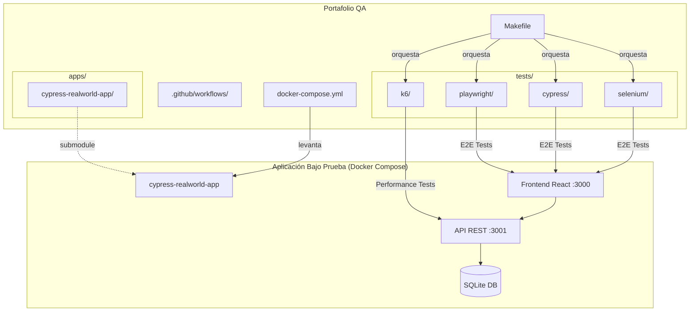
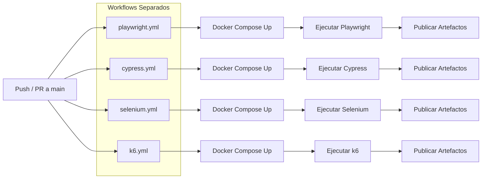
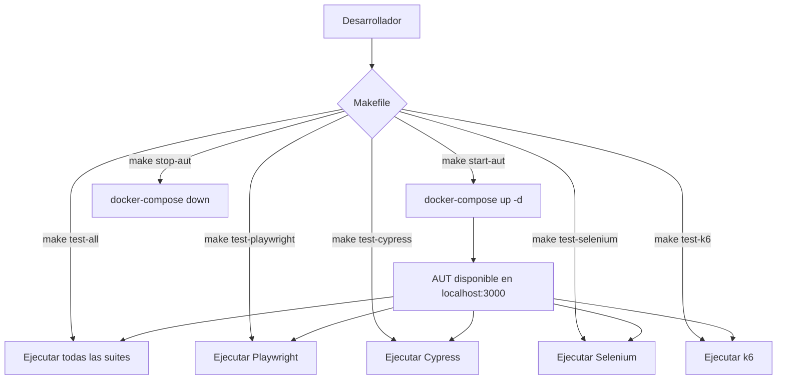
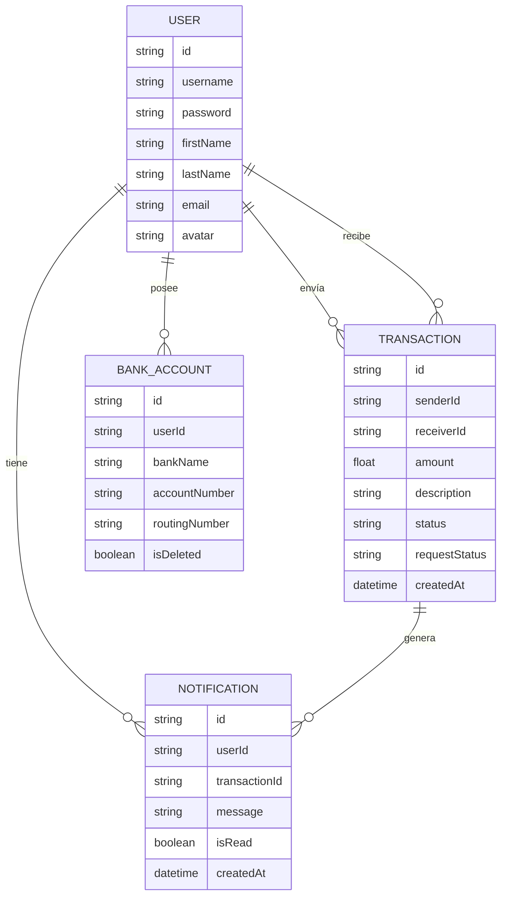

# Documento de Diseño: qa-portfolio

## Resumen de Investigación

### Hallazgos Clave

- **cypress-realworld-app (RWA)**: Es una aplicación full-stack estilo Venmo creada por el equipo de Cypress. Incluye autenticación (login/registro), transacciones financieras (enviar/solicitar dinero), cuentas bancarias, notificaciones y perfiles de usuario. El backend expone una API REST y utiliza una base de datos SQLite con seeding de datos. Se ejecuta localmente en `http://localhost:3000` por defecto. ([Fuente](https://github.com/cypress-io/cypress-realworld-app))
- **Playwright POM**: La documentación oficial de Playwright recomienda el patrón Page Object Model para encapsular selectores y acciones en clases reutilizables, mejorando la mantenibilidad. Los fixtures de Playwright permiten inyectar page objects en los tests. ([Fuente](https://playwright.dev/docs/pom))
- **k6 Thresholds**: k6 permite definir umbrales como criterios pass/fail para métricas como `http_req_duration` (p95) y `http_req_failed`. Cuando un umbral falla, k6 retorna un código de salida no-cero, ideal para integración CI/CD. ([Fuente](https://grafana.com/docs/k6/latest/using-k6/thresholds/))
- **GitHub Actions**: Soporta ejecución paralela mediante jobs independientes y estrategia matrix. Se pueden publicar artefactos con `actions/upload-artifact` y configurar servicios previos con steps de setup.
- **Docker Compose**: Permite definir y ejecutar aplicaciones multi-contenedor. Ideal para levantar la AUT y sus dependencias de forma reproducible con un solo comando (`docker-compose up`). ([Fuente](https://docs.docker.com/compose/))
- **Git Submodules**: Permiten incluir un repositorio externo como referencia versionada dentro de otro repositorio, manteniendo la independencia de ambos. Ideal para incluir la AUT sin duplicar su código. ([Fuente](https://git-scm.com/book/en/v2/Git-Tools-Submodules))

---

## Visión General

Este diseño describe la arquitectura y componentes del portafolio de QA Engineer, un proyecto que demuestra competencia en múltiples frameworks de testing automatizado. Todas las suites de pruebas se ejecutan contra la **cypress-realworld-app** (una aplicación financiera tipo Venmo con autenticación, transacciones, notificaciones y perfiles de usuario).

El proyecto se organiza como un monorepo con la AUT incluida como submódulo de Git en `apps/cypress-realworld-app/`, las suites de pruebas organizadas bajo el directorio `tests/` con subdirectorios independientes por framework, un archivo `docker-compose.yml` en la raíz para levantar la AUT, y un `Makefile` como interfaz unificada de ejecución. Los pipelines de CI/CD se implementan como workflows separados de GitHub Actions por framework.

### Decisiones de Diseño

| Decisión | Elección | Justificación |
|---|---|---|
| Inclusión de la AUT | Git Submodule en `apps/` | Mantiene la AUT como referencia versionada sin duplicar código; permite actualizaciones independientes |
| Orquestación de la AUT | Docker Compose | Entorno reproducible con un solo comando; encapsula dependencias de la AUT en contenedores |
| Interfaz de ejecución | Makefile en la raíz | Proporciona una interfaz unificada y simple (`make test-all`, `make test-playwright`, etc.) sin requerir conocimiento de cada framework |
| Organización de tests | Directorio `tests/` con subdirectorios por framework | Separación clara entre la AUT (`apps/`) y las pruebas (`tests/`); cada framework mantiene independencia |
| Pipelines CI/CD | Workflows separados por framework | Facilita mantenimiento independiente; permite ejecución selectiva; fallos aislados por framework |
| Lenguaje Playwright | TypeScript | Requerido por los requisitos; tipado estático mejora mantenibilidad |
| Lenguaje Cypress | JavaScript | Estándar de la industria para Cypress; menor barrera de entrada |
| Lenguaje Selenium | Python + pytest | Ampliamente usado en QA; demuestra versatilidad multi-lenguaje |
| Patrón de diseño E2E | Page Object Model | Requerido por requisitos 3 y 5; estándar de la industria |
| Reporter Cypress | mochawesome | Mencionado en requisitos; genera reportes HTML combinables |
| Gestión WebDriver | webdriver-manager (Selenium) | Automatiza descarga de drivers; requerido por requisito 5.5 |
| Herramienta de rendimiento | k6 | Requerido por requisitos; scripts en JavaScript, CLI ligero |
| CI/CD | GitHub Actions | Requerido por requisito 7; gratuito para repos públicos |

---

## Arquitectura

### Diagrama de Arquitectura General




### Diagrama de Estructura del Proyecto

```mermaid
graph TD
    ROOT[qa-portfolio/] --> APPS[apps/]
    ROOT --> TESTS[tests/]
    ROOT --> GH[.github/workflows/]
    ROOT --> DC[docker-compose.yml]
    ROOT --> MK[Makefile]
    ROOT --> README[README.md]
    ROOT --> ENV[.env.example]

    APPS --> RWA[cypress-realworld-app/ &#40;submodule&#41;]

    TESTS --> PW[playwright/]
    TESTS --> CY[cypress/]
    TESTS --> SE[selenium/]
    TESTS --> K6[k6/]

    PW --> PW_PAGES[pages/]
    PW --> PW_TESTS[tests/]
    PW --> PW_CFG[playwright.config.ts]
    PW --> PW_PKG[package.json]
    PW --> PW_README[README.md]

    CY --> CY_E2E[e2e/]
    CY --> CY_SUP[support/]
    CY --> CY_CFG[cypress.config.js]
    CY --> CY_PKG[package.json]
    CY --> CY_README[README.md]

    SE --> SE_PAGES[pages/]
    SE --> SE_TESTS[tests/]
    SE --> SE_REQ[requirements.txt]
    SE --> SE_CFG[conftest.py]
    SE --> SE_README[README.md]

    K6 --> K6_SCRIPTS[scripts/]
    K6 --> K6_README[README.md]

    GH --> GH_PW[playwright.yml]
    GH --> GH_CY[cypress.yml]
    GH --> GH_SE[selenium.yml]
    GH --> GH_K6[k6.yml]
```



### Flujo de Ejecución en CI/CD



### Flujo de Ejecución Local con Makefile



---

## Componentes e Interfaces

### 1. Componente: Estructura Raíz del Proyecto

**Responsabilidad**: Proporcionar la organización de directorios, configuración compartida, orquestación y documentación principal del portafolio.

**Archivos clave**:
- `README.md`: Documentación principal del portafolio (descripción, tecnologías, estructura con `apps/`, `tests/`, `docker-compose.yml` y `Makefile`, instrucciones de instalación y ejecución).
- `.env.example`: Plantilla de variables de entorno compartidas (ej. `BASE_URL=http://localhost:3000`).
- `docker-compose.yml`: Definición de servicios para levantar la AUT y sus dependencias.
- `Makefile`: Interfaz unificada de ejecución con targets para la AUT y las suites de pruebas.
- `.gitignore`: Exclusiones comunes (node_modules, __pycache__, reportes generados, etc.).
- `.gitmodules`: Configuración del submódulo de Git para la AUT.

**Interfaz con otros componentes**: Cada subdirectorio de framework en `tests/` lee la variable `BASE_URL` desde variables de entorno o desde su propia configuración, usando `.env.example` como referencia. El `Makefile` invoca los comandos de ejecución de cada suite. El `docker-compose.yml` levanta la AUT que todas las suites consumen.

---

### 2. Componente: AUT como Submódulo (`apps/cypress-realworld-app/`)

**Responsabilidad**: Contener la aplicación bajo prueba como un submódulo de Git, permitiendo su inclusión versionada sin duplicar código.

**Estructura interna**:

```
apps/
└── cypress-realworld-app/   (Git submodule)
    ├── src/
    ├── backend/
    ├── package.json
    └── ...
```

**Interfaces**:

| Elemento | Tipo | Descripción |
|---|---|---|
| `.gitmodules` | Configuración Git | Define la URL del repositorio remoto y la ruta local del submódulo |
| `apps/cypress-realworld-app/` | Directorio | Contiene el código fuente de la AUT, referenciado por Docker Compose |

---

### 3. Componente: Docker Compose (`docker-compose.yml`)

**Responsabilidad**: Definir y orquestar los servicios necesarios para ejecutar la AUT y sus dependencias en contenedores, proporcionando un entorno reproducible.

**Configuración — Interfaz de ejemplo**:

```yaml
# docker-compose.yml
version: '3.8'

services:
  realworld-app:
    build:
      context: ./apps/cypress-realworld-app
    ports:
      - "3000:3000"
      - "3001:3001"
    environment:
      - NODE_ENV=development
    healthcheck:
      test: ["CMD", "curl", "-f", "http://localhost:3000"]
      interval: 10s
      timeout: 5s
      retries: 5
```

**Interfaces**:

| Elemento | Tipo | Descripción |
|---|---|---|
| `docker-compose.yml` | Configuración | Define servicios, puertos, variables de entorno y healthchecks |
| Puerto 3000 | Red | Frontend de la AUT accesible para suites E2E |
| Puerto 3001 | Red | API REST de la AUT accesible para k6 |

---

### 4. Componente: Makefile

**Responsabilidad**: Proporcionar una interfaz unificada de ejecución para levantar/detener la AUT y ejecutar las suites de pruebas de forma individual o conjunta.

**Configuración — Interfaz de ejemplo**:

```makefile
# Makefile
.PHONY: start-aut stop-aut test-all test-playwright test-cypress test-selenium test-k6

start-aut:
	docker-compose up -d
	@echo "Esperando a que la AUT esté disponible..."
	@until curl -s http://localhost:3000 > /dev/null; do sleep 2; done
	@echo "AUT disponible en http://localhost:3000"

stop-aut:
	docker-compose down

test-playwright:
	cd tests/playwright && npx playwright test

test-cypress:
	cd tests/cypress && npx cypress run

test-selenium:
	cd tests/selenium && python -m pytest tests/ --html=reports/report.html

test-k6:
	cd tests/k6 && k6 run scripts/load-test.js

test-all: test-playwright test-cypress test-selenium test-k6
```

**Interfaces**:

| Target | Descripción |
|---|---|
| `make start-aut` | Levanta la AUT mediante Docker Compose y espera a que esté disponible |
| `make stop-aut` | Detiene la AUT y limpia los contenedores |
| `make test-all` | Ejecuta todas las suites de pruebas secuencialmente |
| `make test-playwright` | Ejecuta únicamente la suite de Playwright |
| `make test-cypress` | Ejecuta únicamente la suite de Cypress |
| `make test-selenium` | Ejecuta únicamente la suite de Selenium |
| `make test-k6` | Ejecuta únicamente la suite de k6 |


---

### 5. Componente: Suite Playwright (`tests/playwright/`)

**Responsabilidad**: Ejecutar pruebas E2E contra la AUT usando Playwright con TypeScript y el patrón Page Object Model.

**Estructura interna**:

```
tests/playwright/
├── package.json
├── playwright.config.ts
├── tsconfig.json
├── README.md
├── pages/
│   ├── LoginPage.ts
│   ├── SignUpPage.ts
│   ├── TransactionPage.ts
│   └── NotificationPage.ts
└── tests/
    ├── login.spec.ts
    ├── signup.spec.ts
    ├── transaction.spec.ts
    └── notification.spec.ts
```

**Interfaces**:

| Elemento | Tipo | Descripción |
|---|---|---|
| `playwright.config.ts` | Configuración | Define `baseURL`, navegadores (`chromium`, `firefox`), timeouts, reporter HTML |
| `pages/*.ts` | Page Objects | Clases que encapsulan selectores y acciones de cada página de la AUT |
| `tests/*.spec.ts` | Tests | Archivos de prueba que usan los Page Objects para interactuar con la AUT |

**Page Object Model — Interfaz de ejemplo**:

```typescript
// tests/playwright/pages/LoginPage.ts
export class LoginPage {
  constructor(private page: Page) {}

  async navigate(): Promise<void>;
  async fillUsername(username: string): Promise<void>;
  async fillPassword(password: string): Promise<void>;
  async submit(): Promise<void>;
  async getErrorMessage(): Promise<string>;
}
```

**Configuración — Interfaz de ejemplo**:

```typescript
// tests/playwright/playwright.config.ts
export default defineConfig({
  baseURL: process.env.BASE_URL || 'http://localhost:3000',
  timeout: 30000,
  retries: 1,
  reporter: [['html', { open: 'never' }]],
  use: {
    screenshot: 'only-on-failure',
    trace: 'on-first-retry',
  },
  projects: [
    { name: 'chromium', use: { ...devices['Desktop Chrome'] } },
    { name: 'firefox', use: { ...devices['Desktop Firefox'] } },
  ],
});
```

---

### 6. Componente: Suite Cypress (`tests/cypress/`)

**Responsabilidad**: Ejecutar pruebas E2E contra la AUT usando Cypress con JavaScript, custom commands y reporter mochawesome.

**Estructura interna**:

```
tests/cypress/
├── package.json
├── cypress.config.js
├── README.md
├── e2e/
│   ├── login.cy.js
│   ├── signup.cy.js
│   ├── transaction.cy.js
│   └── notification.cy.js
├── support/
│   ├── commands.js
│   └── e2e.js
└── fixtures/
    └── users.json
```

**Interfaces**:

| Elemento | Tipo | Descripción |
|---|---|---|
| `cypress.config.js` | Configuración | Define `baseUrl`, timeouts, reporter mochawesome, video y screenshots |
| `support/commands.js` | Custom Commands | Comandos reutilizables como `cy.login(username, password)` |
| `e2e/*.cy.js` | Tests | Archivos de prueba que usan custom commands y la API de Cypress |
| `fixtures/*.json` | Datos de prueba | Datos estáticos para las pruebas (usuarios, transacciones) |

**Custom Command — Interfaz de ejemplo**:

```javascript
// tests/cypress/support/commands.js
Cypress.Commands.add('login', (username, password) => {
  cy.visit('/signin');
  cy.get('[data-test=signin-username]').type(username);
  cy.get('[data-test=signin-password]').type(password);
  cy.get('[data-test=signin-submit]').click();
});
```

**Configuración — Interfaz de ejemplo**:

```javascript
// tests/cypress/cypress.config.js
module.exports = defineConfig({
  e2e: {
    baseUrl: process.env.BASE_URL || 'http://localhost:3000',
    defaultCommandTimeout: 10000,
    video: true,
    screenshotOnRunFailure: true,
    reporter: 'mochawesome',
    reporterOptions: {
      reportDir: 'reports',
      overwrite: false,
      html: true,
      json: true,
    },
  },
});
```

---

### 7. Componente: Suite Selenium (`tests/selenium/`)

**Responsabilidad**: Ejecutar pruebas E2E contra la AUT usando Selenium WebDriver con Python, pytest y el patrón Page Object Model.

**Estructura interna**:

```
tests/selenium/
├── requirements.txt
├── conftest.py
├── pytest.ini
├── README.md
├── pages/
│   ├── base_page.py
│   ├── login_page.py
│   ├── signup_page.py
│   ├── transaction_page.py
│   └── notification_page.py
└── tests/
    ├── test_login.py
    ├── test_signup.py
    ├── test_transaction.py
    └── test_notification.py
```

**Interfaces**:

| Elemento | Tipo | Descripción |
|---|---|---|
| `requirements.txt` | Dependencias | selenium, pytest, pytest-html, webdriver-manager |
| `conftest.py` | Configuración pytest | Fixtures para inicializar WebDriver con webdriver-manager y configurar URL base |
| `pages/*.py` | Page Objects | Clases que encapsulan selectores y acciones de cada página |
| `tests/test_*.py` | Tests | Archivos de prueba que usan Page Objects |

**Page Object Model — Interfaz de ejemplo**:

```python
# tests/selenium/pages/base_page.py
class BasePage:
    def __init__(self, driver):
        self.driver = driver
        self.base_url = os.environ.get('BASE_URL', 'http://localhost:3000')

    def navigate(self, path=''):
        self.driver.get(f'{self.base_url}{path}')

    def find_element(self, locator):
        return WebDriverWait(self.driver, 10).until(
            EC.presence_of_element_located(locator)
        )

    def take_screenshot(self, name):
        self.driver.save_screenshot(f'screenshots/{name}.png')
```

**Fixture de conftest — Interfaz de ejemplo**:

```python
# tests/selenium/conftest.py
@pytest.fixture
def driver():
    service = Service(ChromeDriverManager().install())
    options = webdriver.ChromeOptions()
    options.add_argument('--headless')
    driver = webdriver.Chrome(service=service, options=options)
    yield driver
    driver.quit()
```

---

### 8. Componente: Suite k6 (`tests/k6/`)

**Responsabilidad**: Ejecutar pruebas de rendimiento (carga y estrés) contra la API de la AUT usando k6.

**Estructura interna**:

```
tests/k6/
├── README.md
├── scripts/
│   ├── load-test.js
│   └── stress-test.js
└── helpers/
    └── config.js
```

**Interfaces**:

| Elemento | Tipo | Descripción |
|---|---|---|
| `scripts/load-test.js` | Script k6 | Escenario de carga: simula N usuarios concurrentes durante un período definido |
| `scripts/stress-test.js` | Script k6 | Escenario de estrés: incrementa gradualmente usuarios virtuales hasta encontrar límites |
| `helpers/config.js` | Configuración | Exporta URL base de la API y credenciales de prueba |

**Script de carga — Interfaz de ejemplo**:

```javascript
// tests/k6/scripts/load-test.js
import http from 'k6/http';
import { check, sleep } from 'k6';

export const options = {
  stages: [
    { duration: '1m', target: 20 },  // ramp-up
    { duration: '3m', target: 20 },  // steady state
    { duration: '1m', target: 0 },   // ramp-down
  ],
  thresholds: {
    http_req_duration: ['p(95)<500'],
    http_req_failed: ['rate<0.05'],
  },
};

export default function () {
  const res = http.get(`${BASE_URL}/api/transactions`);
  check(res, { 'status is 200': (r) => r.status === 200 });
  sleep(1);
}
```


---

### 9. Componente: Pipelines CI/CD (`.github/workflows/`)

**Responsabilidad**: Orquestar la ejecución de cada suite de pruebas en workflows separados de GitHub Actions, levantar la AUT mediante Docker Compose, y publicar reportes como artefactos.

**Estructura interna**:

```
.github/
└── workflows/
    ├── playwright.yml
    ├── cypress.yml
    ├── selenium.yml
    └── k6.yml
```

**Interfaces**:

| Elemento | Tipo | Descripción |
|---|---|---|
| `playwright.yml` | Workflow GH Actions | Levanta la AUT con Docker Compose, ejecuta la suite Playwright y publica artefactos |
| `cypress.yml` | Workflow GH Actions | Levanta la AUT con Docker Compose, ejecuta la suite Cypress y publica artefactos |
| `selenium.yml` | Workflow GH Actions | Levanta la AUT con Docker Compose, ejecuta la suite Selenium y publica artefactos |
| `k6.yml` | Workflow GH Actions | Levanta la AUT con Docker Compose, ejecuta la suite k6 y publica artefactos |

**Workflow — Estructura de ejemplo (playwright.yml)**:

```yaml
# .github/workflows/playwright.yml
name: Playwright Tests
on:
  push:
    branches: [main]
  pull_request:
    branches: [main]

jobs:
  playwright-tests:
    runs-on: ubuntu-latest
    steps:
      - name: Checkout repositorio
        uses: actions/checkout@v4
        with:
          submodules: true

      - name: Levantar AUT con Docker Compose
        run: docker-compose up -d --wait

      - name: Instalar dependencias Playwright
        working-directory: tests/playwright
        run: |
          npm ci
          npx playwright install --with-deps

      - name: Ejecutar Suite Playwright
        working-directory: tests/playwright
        run: npx playwright test

      - name: Publicar reporte Playwright
        if: always()
        uses: actions/upload-artifact@v4
        with:
          name: playwright-report
          path: tests/playwright/playwright-report/

      - name: Detener AUT
        if: always()
        run: docker-compose down
```

**Workflow — Estructura de ejemplo (cypress.yml)**:

```yaml
# .github/workflows/cypress.yml
name: Cypress Tests
on:
  push:
    branches: [main]
  pull_request:
    branches: [main]

jobs:
  cypress-tests:
    runs-on: ubuntu-latest
    steps:
      - name: Checkout repositorio
        uses: actions/checkout@v4
        with:
          submodules: true

      - name: Levantar AUT con Docker Compose
        run: docker-compose up -d --wait

      - name: Instalar dependencias Cypress
        working-directory: tests/cypress
        run: npm ci

      - name: Ejecutar Suite Cypress
        working-directory: tests/cypress
        run: npx cypress run

      - name: Publicar reporte Cypress
        if: always()
        uses: actions/upload-artifact@v4
        with:
          name: cypress-report
          path: tests/cypress/reports/

      - name: Detener AUT
        if: always()
        run: docker-compose down
```

**Workflow — Estructura de ejemplo (selenium.yml)**:

```yaml
# .github/workflows/selenium.yml
name: Selenium Tests
on:
  push:
    branches: [main]
  pull_request:
    branches: [main]

jobs:
  selenium-tests:
    runs-on: ubuntu-latest
    steps:
      - name: Checkout repositorio
        uses: actions/checkout@v4
        with:
          submodules: true

      - name: Levantar AUT con Docker Compose
        run: docker-compose up -d --wait

      - name: Instalar dependencias Selenium
        working-directory: tests/selenium
        run: pip install -r requirements.txt

      - name: Ejecutar Suite Selenium
        working-directory: tests/selenium
        run: python -m pytest tests/ --html=reports/report.html

      - name: Publicar reporte Selenium
        if: always()
        uses: actions/upload-artifact@v4
        with:
          name: selenium-report
          path: tests/selenium/reports/

      - name: Detener AUT
        if: always()
        run: docker-compose down
```

**Workflow — Estructura de ejemplo (k6.yml)**:

```yaml
# .github/workflows/k6.yml
name: k6 Performance Tests
on:
  push:
    branches: [main]
  pull_request:
    branches: [main]

jobs:
  k6-tests:
    runs-on: ubuntu-latest
    steps:
      - name: Checkout repositorio
        uses: actions/checkout@v4
        with:
          submodules: true

      - name: Instalar k6
        run: |
          sudo gpg -k
          sudo gpg --no-default-keyring --keyring /usr/share/keyrings/k6-archive-keyring.gpg --keyserver hkp://keyserver.ubuntu.com:80 --recv-keys C5AD17C747E3415A3642D57D77C6C491D6AC1D68
          echo "deb [signed-by=/usr/share/keyrings/k6-archive-keyring.gpg] https://dl.k6.io/deb stable main" | sudo tee /etc/apt/sources.list.d/k6.list
          sudo apt-get update
          sudo apt-get install k6

      - name: Levantar AUT con Docker Compose
        run: docker-compose up -d --wait

      - name: Ejecutar Suite k6
        working-directory: tests/k6
        run: k6 run scripts/load-test.js --summary-export=reports/summary.json

      - name: Publicar reporte k6
        if: always()
        uses: actions/upload-artifact@v4
        with:
          name: k6-report
          path: tests/k6/reports/

      - name: Detener AUT
        if: always()
        run: docker-compose down
```

---

## Modelos de Datos

Este proyecto no define modelos de datos propios. Las suites de pruebas interactúan con los modelos de datos existentes de la cypress-realworld-app. A continuación se documentan los modelos relevantes de la AUT que las pruebas necesitan conocer:

### Modelos de la AUT Relevantes para las Pruebas



### Datos de Prueba

Las suites utilizan datos de prueba predefinidos que provienen del seeding de la AUT. Los datos de prueba comunes incluyen:

| Dato | Valor por defecto | Uso |
|---|---|---|
| Usuario de prueba | `Katharina_Bernier` / `s3cret` | Login en todas las suites E2E |
| URL base UI | `http://localhost:3000` | Navegación en Playwright, Cypress, Selenium |
| URL base API | `http://localhost:3001/api` | Peticiones en k6 |

### Configuración Compartida

Todas las suites leen la URL base desde variables de entorno para mantener la configuración centralizada:

| Variable | Descripción | Valor por defecto |
|---|---|---|
| `BASE_URL` | URL base de la AUT (frontend) | `http://localhost:3000` |
| `API_URL` | URL base de la API de la AUT | `http://localhost:3001/api` |


---

## Manejo de Errores

### Estrategia General

Cada suite de pruebas implementa su propia estrategia de manejo de errores, alineada con las capacidades de su framework. El objetivo común es proporcionar información diagnóstica suficiente para identificar la causa raíz de un fallo. Docker Compose y el Makefile añaden una capa adicional de manejo de errores para la orquestación de la AUT.

### Por Componente

#### Docker Compose / AUT
| Escenario de Error | Comportamiento | Requisito |
|---|---|---|
| Docker Compose no instalado | El Makefile falla con error descriptivo indicando que Docker Compose es necesario | 2.1 |
| AUT no inicia (error de build) | `docker-compose up` falla con logs del contenedor; el Makefile reporta el error | 2.1, 2.2 |
| AUT no responde (healthcheck falla) | El Makefile espera con timeout y reporta que la AUT no está disponible | 2.2, 2.5 |
| Puerto ocupado | Docker Compose falla con error de puerto en uso; se muestra el conflicto | 2.2 |
| Submódulo no inicializado | `git submodule update --init` necesario; error descriptivo si `apps/cypress-realworld-app/` está vacío | 1.1 |

#### Makefile
| Escenario de Error | Comportamiento | Requisito |
|---|---|---|
| Target no reconocido | Make muestra error estándar con los targets disponibles | 1.4 |
| Suite falla durante `make test-all` | El Makefile reporta qué suite falló; continúa o detiene según configuración | 1.4 |
| AUT no levantada antes de ejecutar tests | La suite correspondiente falla con error de conexión; se sugiere ejecutar `make start-aut` | 2.4, 2.5 |

#### Suite Playwright
| Escenario de Error | Comportamiento | Requisito |
|---|---|---|
| AUT no disponible | El test falla con timeout al intentar navegar; el reporte muestra el error de conexión | 2.4 |
| Test falla | Captura de pantalla automática del estado del navegador (configurado en `tests/playwright/playwright.config.ts` con `screenshot: 'only-on-failure'`) | 3.6 |
| Elemento no encontrado | Timeout con mensaje descriptivo indicando el selector que no se encontró | — |
| Timeout de navegación | Error con detalle de la URL que no respondió a tiempo | — |

#### Suite Cypress
| Escenario de Error | Comportamiento | Requisito |
|---|---|---|
| AUT no disponible | Cypress falla al intentar `cy.visit()` con error de conexión; el reporte mochawesome registra el fallo | 2.4 |
| Test falla | Captura de pantalla automática y video de la ejecución completa (configurado en `tests/cypress/cypress.config.js`) | 4.6 |
| Comando custom falla | El error se propaga al test con stack trace completo | — |
| Timeout de comando | Error con detalle del comando que excedió `defaultCommandTimeout` | — |

#### Suite Selenium
| Escenario de Error | Comportamiento | Requisito |
|---|---|---|
| AUT no disponible | `WebDriverException` al intentar navegar; pytest registra el error en el reporte | 2.4 |
| Test falla | Captura de pantalla automática mediante hook `pytest_runtest_makereport` en `tests/selenium/conftest.py` | 5.6 |
| WebDriver no disponible | `webdriver-manager` intenta descargar el driver; si falla, error descriptivo | 5.5 |
| Elemento no encontrado | `TimeoutException` con detalle del locator que no se encontró | — |

#### Suite k6
| Escenario de Error | Comportamiento | Requisito |
|---|---|---|
| AUT no disponible | Las peticiones HTTP fallan; los checks reportan fallos; los thresholds se exceden | 2.4 |
| Threshold excedido | k6 retorna código de salida no-cero; el pipeline CI/CD marca el workflow como fallido | 6.4, 7.4 |
| Error de conexión | Métrica `http_req_failed` incrementa; visible en el reporte de métricas | 6.5 |

#### Pipelines CI/CD (Workflows Separados)
| Escenario de Error | Comportamiento | Requisito |
|---|---|---|
| Docker Compose falla en un workflow | El workflow correspondiente falla; los demás workflows no se ven afectados | 7.2 |
| Suite falla en su workflow | El workflow se marca como fallido; los reportes se publican como artefactos con `if: always()` | 7.4 |
| Artefacto no generado | El step de upload-artifact falla con warning pero no bloquea el workflow | 7.3 |
| Submódulo no disponible | El checkout con `submodules: true` falla; el workflow se marca como fallido | 7.2 |

---

## Estrategia de Testing

### Enfoque General

Este proyecto es en sí mismo un proyecto de testing — las "pruebas" son el producto principal. Por lo tanto, la estrategia de testing se enfoca en verificar que las suites de pruebas funcionan correctamente contra la AUT, no en testear código de aplicación.

### Por qué no se aplica Property-Based Testing

Property-Based Testing (PBT) **no es apropiado** para este proyecto por las siguientes razones:

1. **No hay funciones puras con entrada/salida**: El proyecto consiste en suites de pruebas E2E que interactúan con una aplicación web a través del navegador. No hay transformaciones de datos, parsers, serializadores ni lógica de negocio propia que testear.
2. **Las pruebas son side-effect-only**: Cada test navega páginas, hace clics, llena formularios y verifica estados visuales. Son operaciones con efectos secundarios, no funciones con propiedades universales.
3. **Configuración e infraestructura**: Los pipelines CI/CD, Docker Compose, Makefile y la estructura del proyecto son configuración declarativa, no código con comportamiento variable según inputs.
4. **Los criterios de aceptación son verificables por ejemplo**: Cada criterio se verifica ejecutando la suite correspondiente y comprobando que los reportes, capturas y artefactos se generan correctamente.

### Tipos de Verificación Aplicables

#### 1. Pruebas de Humo (Smoke Tests)
Verifican que cada suite se ejecuta correctamente contra la AUT:

| Verificación | Suite | Criterios Validados |
|---|---|---|
| Docker Compose levanta la AUT correctamente | Docker Compose | 2.1, 2.2 |
| El Makefile ejecuta los targets correctamente | Makefile | 1.4, 2.5 |
| La suite se ejecuta sin errores de configuración | Todas | 1.6, 2.2, 2.3 |
| Los reportes se generan en el formato esperado | Playwright, Cypress, Selenium | 3.3, 4.3, 5.4 |
| Los thresholds de k6 se evalúan correctamente | k6 | 6.4, 6.5 |

#### 2. Pruebas de Integración
Verifican que los componentes funcionan juntos:

| Verificación | Componentes | Criterios Validados |
|---|---|---|
| Cada workflow ejecuta su suite correspondiente | Workflows + Suites | 7.1, 7.2 |
| Los artefactos se publican correctamente en cada workflow | Workflows + Reportes | 7.3, 7.4 |
| Las suites leen la URL base desde configuración | Todas las suites + .env | 2.2, 2.3 |
| El submódulo se clona correctamente en CI | Git Submodule + Workflows | 1.1, 7.2 |

#### 3. Verificación Manual / Revisión de Código
Para criterios que no son automatizables:

| Verificación | Criterios Validados |
|---|---|
| La estructura de directorios sigue la convención definida (`apps/`, `tests/`) | 1.1, 1.2 |
| El `docker-compose.yml` define los servicios necesarios | 2.1 |
| El `Makefile` incluye todos los targets requeridos | 1.4, 2.5 |
| Los README contienen las secciones requeridas | 1.5, 6.6, 7.6, 8.1, 8.2 |
| Los Page Objects encapsulan correctamente la interacción | 3.4, 5.3 |
| Los custom commands de Cypress son reutilizables | 4.4 |
| La documentación incluye ejemplos de reportes | 8.3 |
| La estructura es clara y navegable | 8.4 |

#### 4. Pruebas E2E (el producto principal)
Las suites de pruebas en sí mismas son pruebas E2E contra la AUT. Cada suite verifica los flujos requeridos:

| Flujo | Playwright | Cypress | Selenium | Criterios |
|---|---|---|---|---|
| Inicio de sesión | `tests/playwright/tests/login.spec.ts` | `tests/cypress/e2e/login.cy.js` | `tests/selenium/tests/test_login.py` | 3.2, 4.2, 5.2 |
| Registro de usuario | `tests/playwright/tests/signup.spec.ts` | `tests/cypress/e2e/signup.cy.js` | `tests/selenium/tests/test_signup.py` | 3.2, 4.2, 5.2 |
| Creación de transacciones | `tests/playwright/tests/transaction.spec.ts` | `tests/cypress/e2e/transaction.cy.js` | `tests/selenium/tests/test_transaction.py` | 3.2, 4.2, 5.2 |
| Visualización de notificaciones | `tests/playwright/tests/notification.spec.ts` | `tests/cypress/e2e/notification.cy.js` | `tests/selenium/tests/test_notification.py` | 3.2, 4.2, 5.2 |

#### 5. Pruebas de Rendimiento
Los scripts de k6 verifican el rendimiento de la API de la AUT:

| Escenario | Script | Criterios |
|---|---|---|
| Prueba de carga (usuarios concurrentes) | `tests/k6/scripts/load-test.js` | 6.2 |
| Prueba de estrés (incremento gradual) | `tests/k6/scripts/stress-test.js` | 6.3 |

### Cobertura de Requisitos

| Requisito | Método de Verificación |
|---|---|
| 1. Estructura del Proyecto | Revisión de código + Smoke test de instalación + Verificación de `apps/`, `tests/`, `Makefile` y `docker-compose.yml` |
| 2. Configuración AUT con Docker Compose | Smoke test de `docker-compose up` + Verificación de conectividad + Targets del Makefile |
| 3. Suite Playwright | Ejecución E2E + Verificación de reportes |
| 4. Suite Cypress | Ejecución E2E + Verificación de reportes |
| 5. Suite Selenium | Ejecución E2E + Verificación de reportes |
| 6. Suite k6 | Ejecución de rendimiento + Verificación de thresholds |
| 7. Pipelines CI/CD | Ejecución de cada workflow separado + Verificación de artefactos |
| 8. Documentación | Revisión manual de contenido |